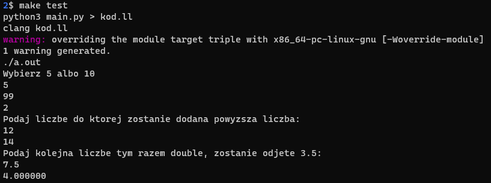

# My simple language BaLang

I designed a very simple programming language and wrote an interpreter for this language using Python. Grammar is in file with .g4 extension in [grammar](https://github.com/BartekGRK/My_language/tree/main/grammar) folder. This format is used by a parser generation tool called ANTLR 4. There is a file IRgen.py in the same folder. It generates LLVM representation of tested grammar from folder [test_example](https://github.com/BartekGRK/My_language/tree/main/test_example) and creates file with .ll extension which can be compiled by Clang (C/C++/Objective-C compiler)


## Installation

[`ANTLR4` installation on Windows/Linux/macOS ](https://www.antlr.org/)

Used [Windows Subsystem for Linux ](https://ubuntu.com/wsl) 

## Usage

- Step 1. Clone/Download this repository
- Step 2. Go to the project directory
- Step 3. Create files 
  ```bash
  make
  ```
  It creates required Lexer, Parser, Listener, Visitor files and tokens 
- Step 4. Start testing your grammar 
  ```bash
  make test
  ```
## Example test
```
S napis = "Wybierz 5 albo 10"                # String
SHOW napis

I WRITE x 

IF x==10 THEN:
    I x = 11
    SHOW x
    I x = 12
    SHOW x
ENDIF

IF x==5 THEN:
    I x = 99
    SHOW x 
ENDIF


I zmienna = 2                                    # Przypisz
SHOW zmienna                          


S napis = "Podaj liczbe do ktorej zostanie dodana powyzsza liczba:"
SHOW napis


I WRITE x                                        # Wczytaj  
I wynik = zmienna + x                            # Przypisanie

SHOW wynik                                       # Print

S napis = "Podaj kolejna liczbe tym razem double, zostanie odjete 3.5:"
SHOW napis

D WRITE z                                         # Przypisanie double
D minus = z - 4.4 + 0.9  

SHOW minus

  ```
`Output`:

